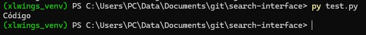

# search-interface
To create an interface using an Excel spreadsheet

## Python Environment Setup
First, python 3.13.12 was installed locally, then the virtual environment xlwings_venv was created and activated

```shell
 >> C:\Users\PC\AppData\Local\Programs\Python\Python313\python.exe -m venv xlwings_venv
 >> xlwings_venv\Scripts\activate.bat
```

Afterwards, the **xlwings** library was installed using pip
```shell
pip install xlwings
```
## Test.py
Once the libraries were installed, a short code was compiled to read the value of the cell "A1" from "Microrreductores" sheet. The result was "Código" which meant the configuration was a success.



## Debugging
If the host github.com is specified in the ~\.ssh\config directory, then you must not specify it in the login command. Example:
**Correct**
```shell
 >> ssh -vT MC1
```
**Incorrect**
```shell
 >> ssh -vT MC1@github.com
```

Why is "python" not recognized in PowerShell. [Explanation](https://stackoverflow.com/questions/47805784/why-is-python-not-recognized-in-powershell)

The solution was to go to 'Manage App Execution Aliases' and turn off 'App Installer' for python. 

```shell
xlwings_venv\Scripts\activate : No se puede cargar el archivo
xlwings_venv\Scripts\Activate.ps1 porque la ejecución de scripts está deshabilitada en este sistema.

    + CategoryInfo          : SecurityError: (:) [], PSSecurityException
    + FullyQualifiedErrorId : UnauthorizedAccess

```
**Solution:** Open Powershell as an administrator and execute
```shell
Set-ExecutionPolicy Unrestricted
```

## Referencias
[Sintaxis básica de redacción y formato](https://docs.github.com/es/get-started/writing-on-github/getting-started-with-writing-and-formatting-on-github/basic-writing-and-formatting-syntax)

[Creating and highlighting code blocks](https://docs.github.com/en/get-started/writing-on-github/working-with-advanced-formatting/creating-and-highlighting-code-blocks)
